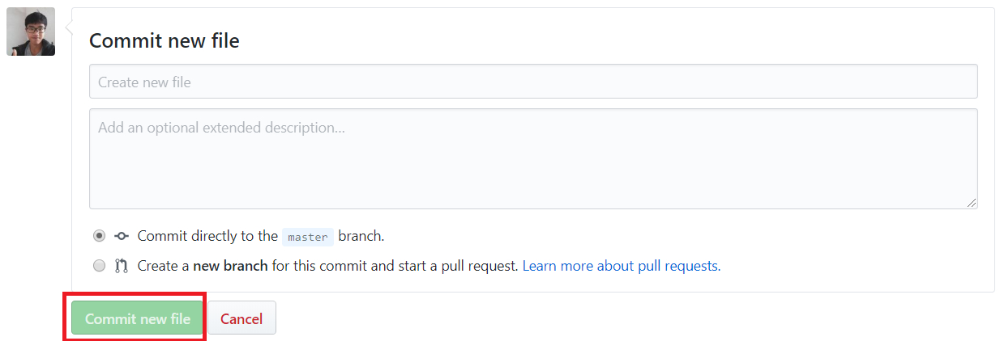
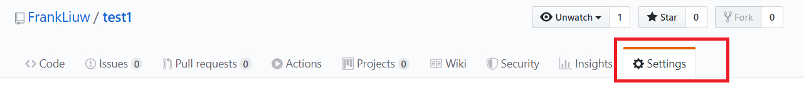
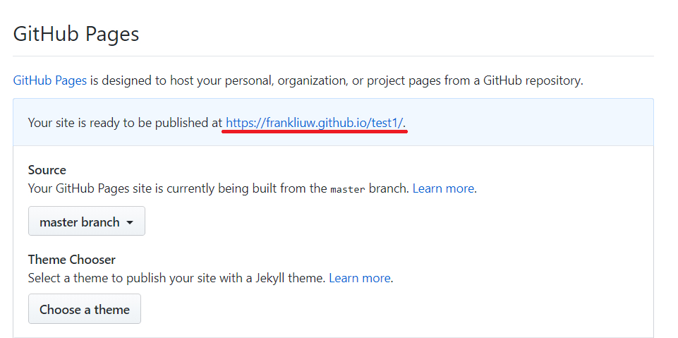

当我们制作出了一个好看的页面苦于无法便捷的让好友查看时我们可以使用Github Pages 来部署这个页面，达到需要。

> 以下操作默认你已经拥有了github账户

# 1. 创建一个新的 Repo
点击下图的绿色按钮

这里是库的设置，只需要填写库的名称(红框处)即可，不可和其他库冲突。

# 2. 创建一个新的文件

将其命名为一个以.html为后缀的文件

# 3. 把已经写好的HTML文件里的代码全选复制到这个文件再提交

# 4. 进入Setting

一直往下滑看到GitHub Pages的选项

这个蓝色的连接我们复制下来，这时在这个链接的基础上后面追加上刚才创建的html文件，比如说index.html,即可预览！
